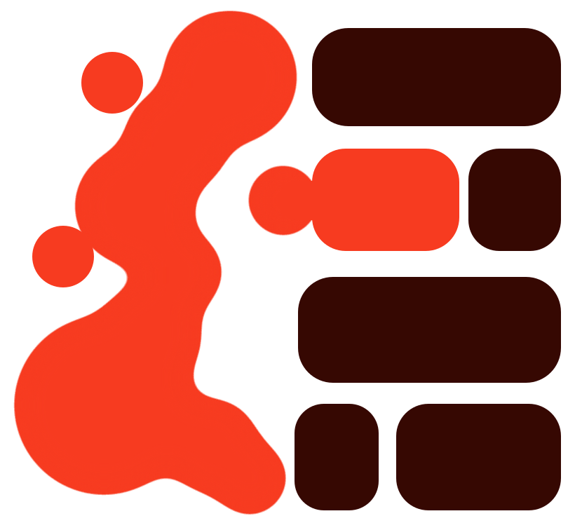

<div align="center">

<picture>
  <source media="(prefers-color-scheme: dark)" srcset="assets/logo-dark.svg">
  
</picture>

<h1>GUML</h1>

**A token-efficient intermediate representation and compiler for LLM-generated interfaces.**

A model writes 25 lines of markup. The compiler writes the fetch, the cancellation, the loading and
empty states, the optimistic update, the rollback, and the accessible names — so the model never
spends tokens on them and cannot get them wrong.

[Documentation](https://guml.vercel.app) · [Playground](https://guml.vercel.app/playground) · [Measurements](https://guml.vercel.app/research/measurements) · [Research report](GUML-Research-Report.md)

</div>

---

## The argument, in one file

Both columns render the same application. The right-hand one is what the compiler emits.

```
page Tasks                                      │ import { useState, useCallback, useEffect, useMemo } from "react";
                                                │
type Task {id, title, done:bool}                │ type Task = { id: string; title: string; done: boolean };
data tasks:Task[] GET /api/tasks                │
  add  POST   /api/tasks      {title}           │ export default function Tasks() {
                             optimistic:prepend │   const [draft, setDraft] = useState("");
  save PATCH  /api/tasks/{id} {done} optimistic │   const [tasks, setTasks] = useState<Task[]>([]);
  drop DELETE /api/tasks/{id}        optimistic │   const [tasksLoading, setTasksLoading] = useState(true);
                                                │   const [tasksError, setTasksError] = useState<string|null>(null);
state draft=""                                  │
state filter=all|open|done                      │   const tasksList = useCallback(() => {
                                                │     const controller = new AbortController();
head Tasks — {tasks.open.count} open            │     retrying("/api/tasks", { signal: controller.signal })
                                                │       .then(…).catch(…).finally(…);
form >tasks.add{title:draft}; draft=""          │     return () => controller.abort();
  input draft aria="New task"                   │   }, []);
  btn Add primary disabled={!draft.trim()}      │
                                                │   const tasksAdd = useCallback(async (body) => {
tabs filter                                     │     const snapshot = tasks;
                                                │     setTasks((prev) => [optimistic, ...prev]);
list tasks where={filter}                       │     try { … } catch { setTasks(snapshot); }
  check {done} >tasks.save                      │   }, [tasks]);
  text {title} strike={done}                    │
  btn Delete quiet aria="Delete {title}"        │   …  ~150 more lines: two more mutations, the filter
  empty Nothing here yet.                       │      memo, and every branch of the render
                                                │ }
25 lines · 178 tokens                           │ 187 lines · 1,441 tokens
```

---

## Status

**Pre-Phase-0.** The compiler works end to end and is tested. The research question it exists to
answer — *can a model actually produce correct GUML, and does that help or hurt?* — is **still
open**, and is **blocked on funded API access**: the sweep needs 90 generations across three models, and
an attempt returned `Your credit balance is too low`. Zero generations have run.

Everything that does not need a model is done and runs in CI — the frozen spec, ten tasks, ten paired React
references, the prompt assembly, the scoring harness, the blind scoresheet, and a scoring self-test over
synthetic generations (`just phase0-verify`). What is missing is the answer, not the instrument.

**So every number in this repository is an authored-artifact measurement with no model in the loop**, and
labelled that way at each site. Nothing here reports how a model performs, because nothing here has asked
one. See [`spec/PHASE0.md`](spec/PHASE0.md) for the protocol and `ROADMAP.md` for what `[⛔]` marks.

```
507 Rust tests · 42 runtime tests · 61 conformance cases · 49 diagnostic codes
16 emitted components typecheck under --strict · 7 fixtures render and pass their accessibility rules
15 tree-sitter corpus cases · 19 documents parse with no error node
1M fuzz iterations with no panic · 95.5% of injected mutations detected, 99.0% without desync
```

| | |
|---|---|
| **Front end** | Lexer, parser, AST, diagnostics. Every error in one pass — a repair loop pays a full generation per round. |
| **Analysis** | Resolver, accessibility rules, static validator, type inference over expressions and aggregates. |
| **Backends** | React + TS, Svelte 5, static HTML, Web Components, JSON UI tree, plus A2UI and MCP-UI emitters. One design-system table, one element table, one expression lowering and one liveness answer between all seven. |
| **Language** | 49 primitives, `def` user components, `js`/`raw` escape hatches, `core`/`app` conformance levels, declared effects. |
| **Theme** | **shadcn/ui by default** — shadcn's own tokens (`--primary`, `--muted`, `--border`, `--ring`, `--radius`, in `oklch`) and its own class strings, so a host already running shadcn drops it in and its palette applies unchanged. A theme is data: `--theme` swaps it, and one is *refused* unless it declares a focus treatment and a contrast floor, which is what keeps a themeable compiler able to promise accessible output. |
| **Registry packages** | `guml add` installs a design system; an entry declares its own children, capabilities, accessibility contract and *what it lowers to* — including `<YourComponent>` with a generated import. `guml.json` states the project's vocabulary once, so the editor and CI cannot disagree about it. |
| **Repair** | `guml repair` — unwrap a code fence, drop trailing commentary, format, apply every unambiguous fix. Bounded, no model call, and it reports which layer did the work. |
| **Tooling** | `fmt` (idempotent, formats invalid input), `highlight`, `validate`, `fix`, `registry --docs`, source maps, language server, VS Code extension. |
| **Distribution** | Five npm packages under `@guml` — see below. The compiler as WebAssembly drives the live playground. |
| **Runtime** | Generated per resource: retry with backoff, response cache with stale-while-revalidate, in-flight deduplication, invalidation on mutation, optimistic apply and rollback — and an error boundary, but only for a document using an escape hatch. |
| **Security** | `guml capabilities` emits a per-document manifest — the exact origins it will contact, whether it contains script, its escape-hatch rate — and a Content-Security-Policy derived from it. `--assert-inert` is the safe-render gate for an untrusted document; `--max-escapes` is the CI ratchet. |
| **Benchmark** | `bench/guml-bench` — the Phase 6 harness, runnable, with **12 of the 150 tasks** it specifies and a report that prints the coverage beside every figure. Plus an edit-locality benchmark measured against *diff-based* React editing rather than regeneration. |
| **Not started** | Playwright/axe/Lighthouse — so the emitted output is proven to typecheck and to server-render, and *not* proven to work when clicked. That is the largest gap in what is verified here. |
| **Blocked, not started** | Everything needing a model, a grader or participants: the Phase 0 sweep (funded API access), blind semantic scoring (a human grader — the author scoring their own output would invalidate it), grammar-constrained decoding (a local model, since hosted APIs expose no client-side CFG masking), and the two human studies. 20 roadmap items, each with its blocker named on the line. |

<details>
<summary><b>Why the compiler owns presentation</b></summary>

<br>

Four invariants hold the reliability claim together, and this is the load-bearing one: **no class
strings, colours, spacing or ARIA plumbing appear in GUML source.** That is the token lever and the
correctness guarantee in the same move — a model that cannot write a class name cannot write the wrong
one, and a `btn` with no accessible name is `GUML0050`, a compile error rather than a lint warning.

The others: the parser collects every error in one pass; diagnostic codes are append-only, because the
repair loop keys on them; and an unsupported construct produces a warning and a visible marker, never
approximate code. A quietly wrong compiler would destroy the claim the whole project rests on.

</details>

---

## Packages

Five on npm, under the `@guml` scope. Which one you want depends on how much of the compiler you need —
the split follows the compiler's own shape, not packaging convenience.

| package | for | unpacked | Node |
|---|---|---|---|
| [`@guml/core`](https://www.npmjs.com/package/@guml/core) | Compile, render, diagnose, repair | 959 KB | no |
| [`@guml/fmt`](https://www.npmjs.com/package/@guml/fmt) | Formatter, canonical form, classification | 231 KB | yes |
| [`@guml/highlight`](https://www.npmjs.com/package/@guml/highlight) | Highlighting, no WebAssembly | 49 KB | yes |
| [`@guml/widgets`](https://www.npmjs.com/package/@guml/widgets) | `chart`, `calendar`, `date`, `upload`, `command` | 22 KB | yes |
| [`@guml/shadcn`](https://www.npmjs.com/package/@guml/shadcn) | 26 tags over all 61 shadcn/ui components | 257 KB | yes |

```sh
pnpm add @guml/core        # compile and render in the browser
pnpm add @guml/fmt         # just the formatter — and it runs in Node
cargo install guml-cli     # the `guml` command
```

`guml-fmt` sits *below the parser* — lexer, registry and diagnostics, no codegen — so a formatter-only
build is 178 KB of wasm rather than 787. `@guml/highlight` has no wasm at all: a hand-written tokeniser
held to the compiler's own classifier by a parity test over every fixture.

`@guml/core` is the one that does **not** run in Node; its wasm is built for the web target and loads
itself with `fetch`. Use the CLI to compile from a shell.

> The unscoped name `guml` is not this project. npm's similarity check refuses it against `gulp`, `gm`,
> `xml`, `toml` and `yaml`.

## Try it

```sh
cargo test --workspace

cargo run -q -p guml-cli -- build   fixtures/b.guml                  # React + TS
cargo run -q -p guml-cli -- build   fixtures/b.guml --backend svelte
cargo run -q -p guml-cli -- build   fixtures/b.guml --backend wc      # no framework, no build step
cargo run -q -p guml-cli -- build   fixtures/b.guml --backend a2ui    # the agent-UI wire format
cargo run -q -p guml-cli -- check   fixtures/invoices.guml --format json
cargo run -q -p guml-cli -- capabilities fixtures                     # what each document will do
cargo run -q -p guml-cli -- explain GUML0065
cargo run -q -p guml-cli -- registry

# What a model actually returns, repaired with no model call:
printf 'Here you go:\n\n```guml\npage P\ndiv\n  span Hi\n```\n' |
  cargo run -q -p guml-cli -- repair

node bench/guml-bench/edit-locality.mjs   # the cost of a *change*, not a first draft
```

---

## What is measured, and what is not

The distinction is kept sharp everywhere in this repo, because the project is a study before it is a
language.

### Measured

Hand-authored fixtures, `cl100k_base`, [`GUML-Research-Report.md`](GUML-Research-Report.md) §1.5:

| Fixture | React + TS + Tailwind | GUML | Reduction |
|---|---:|---:|---:|
| Counter card | 368 | 64 | **82.6%** |
| Task CRUD | 1,441 | 178 | **87.6%** |
| Landing page | 1,648 | 376 | **77.2%** |

Also measured: GUML is **44% smaller than a minified JSON UI IR** for the same application. And
**232 of the landing page's 376 tokens are the prose itself** — so compression is bounded by content,
not by the language. Structure-heavy artifacts approach 8×; content-heavy ones asymptote at 2–3×.

> **The caveat travels with every number above.** Both sides of those comparisons were written by the
> same person, and they are authored artifacts rather than model generations.

### Not measured

Whether a model can *produce* correct GUML, and whether correctness improves or degrades against a
React baseline. Those are hypotheses **H1–H6** in the report, and they are labelled as hypotheses
throughout — never as findings.

### Why this might not work

Kept in the README on purpose. GUML has **zero training data by construction**, and the
low-resource-DSL literature consistently reports degradation on unfamiliar languages. Against that,
Anka (arXiv:2512.23214) reports a constrained DSL beating Python by +40pp on multi-step tasks — but
that is one paper in one narrow domain. Reconciling the two findings *is* the research contribution.
Phase 0 is the two-week experiment that decides which side GUML lands on. Full analysis: report §12.

---

## Repository map

| Path | Contents |
|---|---|
| [`crates/`](crates/) | The Rust compiler: syntax, AST, parser, registry, codegen, driver, CLI, LSP, wasm, formatter |
| [`spec/`](spec/) | The language spec, the conformance suite (the normative definition), stability and registry contracts |
| [`fixtures/`](fixtures/) | Paired GUML / React / JSON-IR artifacts — the source of every token figure |
| [`packages/`](packages/) | The five npm packages — compiler, formatter, highlighter, and two component vocabularies |
| [`docs/`](docs/) | The documentation site (Next.js). Code samples are generated from `fixtures/` and from the compiler, never retyped. |
| [`bench/phase0/`](bench/phase0/) | The kill-or-continue experiment: ten tasks, paired references, prompt assembly, blind rubric |
| [`bench/gen/`](bench/gen/) | Generation test: applications through a live model, scored on parse, validation and requirements |
| [`editors/`](editors/) | VS Code extension (LSP client + generated TextMate grammar) and a tree-sitter grammar |
| [`GUML-Research-Report.md`](GUML-Research-Report.md) | Feasibility study: landscape, literature, novelty, benchmark design, critical review |
| [`ROADMAP.md`](ROADMAP.md) | Phased build plan with gates |

---

## Positioning

Not "a new Markdown" — MDX, Markdoc, A2UI and Vega-Lite already occupy that framing. GUML is an
**intermediate representation plus a compiler**, and the contribution is the **measurement**: where the
token/accuracy frontier sits for LLM-generated UI, and when a purpose-built DSL beats a high-resource
general-purpose language. Google's A2UI is a compile target, not a rival.

---

## Brand

The mark is the compiler's job description. Output arrives amorphous — the blob, which has no edge you
could measure — and leaves as a laid-out interface: rounded bars on a grid, the same shape every time.
The necks reaching rightward are the compiler, and one bar stays accent-coloured because that is where
the transition happens.

| Asset | Use |
|---|---|
| [`assets/logo-mark.svg`](assets/logo-mark.svg) | Canonical. The bars are `currentColor`, so the mark follows the surrounding text colour. |
| [`assets/logo-light.svg`](assets/logo-light.svg) · [`logo-dark.svg`](assets/logo-dark.svg) | Generated from the mark with `currentColor` pinned, for renderers that strip inheritance. |

Signal Orange `#f73b20` is the only accent. Ink Roast `#360802` is body text — a warm near-black, so
copy and accent read as one temperature.

---

<div align="center">

MIT

</div>
